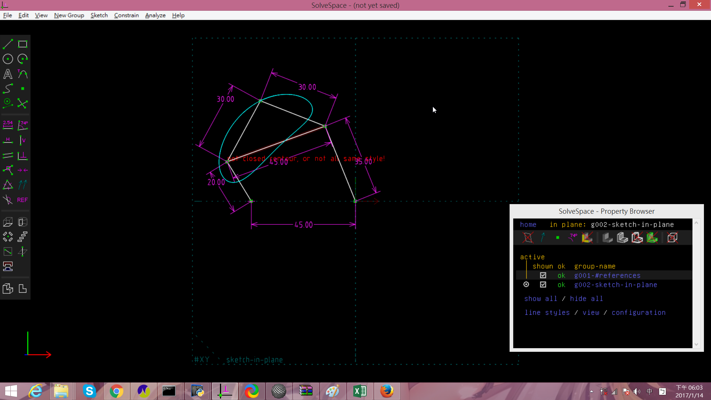
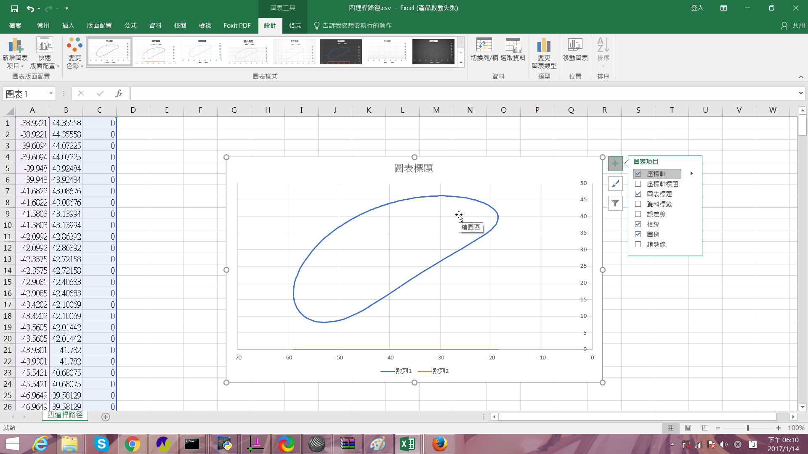
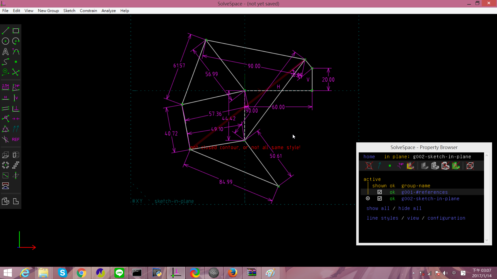
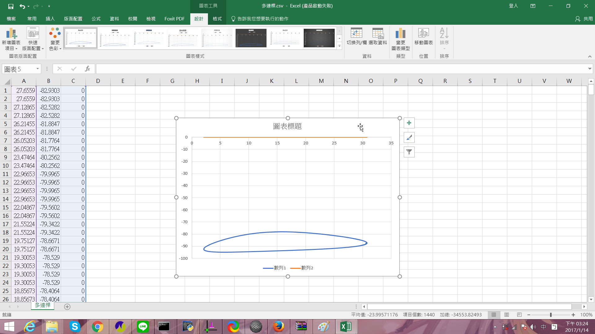

Title: 01/22電腦輔助設計課程總結
Date: 2016-10-6 11:00
Category: HW
Tags: 日常
Author: 40423123

<!-- PELICAN_END_SUMMARY -->

###上課筆記

1.下載mini2016fall.7z工具

2.

3.建立自己的作業倉儲，組長還須建立2016fallcadp_ag8倉儲

4.在倉儲建立gh-pages分支

5.將組別倉儲clone下來，切換到gh-pages分支

6.使用git submodule add -b gh-pages 指令將組員的作業倉儲加入子模組

7.每周定時使用

(1) git submodule init

(2)git submodule update和

(3)git submodule foreach "(git checkout gh-pages; git pull)&"來更新

8.設定shareX的儲存位置

(1)Application settings

(2)path選擇想儲存的位置即可

9.使用solvespace練習繪製零件

###零件繪製作業

<iframe src="https://player.vimeo.com/video/190852426" width="640" height="480" frameborder="0" webkitallowfullscreen mozallowfullscreen allowfullscreen></iframe> 
<a href="https://vimeo.com/190852426">2016-11-09 19-44-34</a> from <a href="https://vimeo.com/user58788851">林嘉文</a> on <a href="https://vimeo.com">Vimeo</a>.

###四連桿

Solvespace 四連桿圖

<a href="./../w7/四連桿追蹤.slvs"> 四連桿.csv</a> (請以滑鼠右鍵存檔)

<a href="./../w7/四連桿路徑.csv">/四連桿.slvs</a> (請以滑鼠右鍵存檔)

###四連桿路徑

<!-- 導入 brython.js -->

<!-- 啟動 brython() -->

<!-- 以下利用 Brython 程式執行繪圖 -->

<canvas id="fourbar" width="600" height="600"></canvas>

###solvespace軟體練習

Extrude (平行長出)

<iframe src="./../data/2323-1.html"width="800"height="600"/></iframe>

Extrude (除料)

<iframe src="./../data/2323-2.html"width="800"height="600"/></iframe>

Lathe (旋轉繞行長出或除料)

<iframe src="./../data/甜甜圈.html"width="800"height="600"/></iframe>

<iframe src="https://player.vimeo.com/video/199431202" width="640" height="326" frameborder="0" webkitallowfullscreen mozallowfullscreen allowfullscreen></iframe>

<a href="https://vimeo.com/199431202">Untitled</a> from <a href="https://vimeo.com/user58788851">林嘉文</a> on <a href="https://vimeo.com">Vimeo</a>.

<iframe src="https://player.vimeo.com/video/199431219" width="640" height="326" frameborder="0" webkitallowfullscreen mozallowfullscreen allowfullscreen></iframe>

<a href="https://vimeo.com/199431219">Untitled</a> from <a href="https://vimeo.com/user58788851">林嘉文</a> on <a href="https://vimeo.com">Vimeo</a>.

<iframe src="https://player.vimeo.com/video/199431216" width="640" height="326" frameborder="0" webkitallowfullscreen mozallowfullscreen allowfullscreen></iframe>

<a href="https://vimeo.com/199431216">Untitled</a> from <a href="https://vimeo.com/user58788851">林嘉文</a> on <a href="https://vimeo.com">Vimeo</a>.

2. Assembly (零件組立)

<iframe src="./../data/箱子組立.html"width="800"height="600"/></iframe>

<iframe src="https://player.vimeo.com/video/199429872" width="640" height="326" frameborder="0" webkitallowfullscreen mozallowfullscreen allowfullscreen></iframe> 
<a href="https://vimeo.com/199429872">-2</a> from <a href="https://vimeo.com/user58788851">林嘉文</a> on <a href="https://vimeo.com">Vimeo</a>.

<iframe src="https://player.vimeo.com/video/199429860" width="640" height="326" frameborder="0" webkitallowfullscreen mozallowfullscreen allowfullscreen></iframe> 
<a href="https://vimeo.com/199429860">-1</a> from <a href="https://vimeo.com/user58788851">林嘉文</a> on <a href="https://vimeo.com">Vimeo</a>.

3.Linkages (fourbar & multilink) (四連桿與多連桿運動模擬)

<iframe src="https://player.vimeo.com/video/199426708" width="640" height="326" frameborder="0" webkitallowfullscreen mozallowfullscreen allowfullscreen></iframe>

<a href="https://vimeo.com/199426708">多連桿路徑</a> from <a href="https://vimeo.com/user58788851">林嘉文</a> on <a href="https://vimeo.com">Vimeo</a>.

###solvespace作業組裝

零件

<iframe src="./../data/洞洞方塊.html"width="800"height="600"/></iframe>

<iframe src="./../data/連接桿.html"width="800"height="600"/></iframe>

組合圖

<iframe src="./../data/組合.html"width="800"height="600"/></iframe>

<iframe src="https://player.vimeo.com/video/199433020" width="640" height="326" frameborder="0" webkitallowfullscreen mozallowfullscreen allowfullscreen></iframe>

<a href="https://vimeo.com/199433020">方塊組合</a> from <a href="https://vimeo.com/user58788851">林嘉文</a> on <a href="https://vimeo.com">Vimeo</a>.

###3D印表機組裝

零件

<iframe src="./../data/短桿.html"width="800"height="600"/></iframe>
<iframe src="./../data/長桿.html"width="800"height="600"/></iframe>
<iframe src="./../data/噴.html"width="800"height="600"/></iframe>
<iframe src="./../data/底盤.html"width="800"height="600"/></iframe>

印表機

<iframe src="./../data/3D印表機.html"width="800"height="600"/></iframe>

組裝影片
<iframe src="https://player.vimeo.com/video/199425257" width="640" height="326" frameborder="0" webkitallowfullscreen mozallowfullscreen allowfullscreen></iframe>

<a href="https://vimeo.com/199425257">3DPR-1</a> from <a href="https://vimeo.com/user58788851">林嘉文</a> on <a href="https://vimeo.com">Vimeo</a>.

<iframe src="https://player.vimeo.com/video/199425269" width="640" height="326" frameborder="0" webkitallowfullscreen mozallowfullscreen allowfullscreen></iframe>

<a href="https://vimeo.com/199425269">3DPR-2</a> from <a href="https://vimeo.com/user58788851">林嘉文</a> on <a href="https://vimeo.com">Vimeo</a>.

###onshape連桿組裝

<iframe src="https://player.vimeo.com/video/199434782" width="640" height="307" frameborder="0" webkitallowfullscreen mozallowfullscreen allowfullscreen></iframe>

<a href="https://vimeo.com/199434782">onshape連桿-1</a> from <a href="https://vimeo.com/user58788851">林嘉文</a> on <a href="https://vimeo.com">Vimeo</a>.

<iframe src="https://player.vimeo.com/video/199434793" width="640" height="307" frameborder="0" webkitallowfullscreen mozallowfullscreen allowfullscreen></iframe>

<a href="https://vimeo.com/199434793">onshape連桿-2</a> from <a href="https://vimeo.com/user58788851">林嘉文</a> on <a href="https://vimeo.com">Vimeo</a>.

